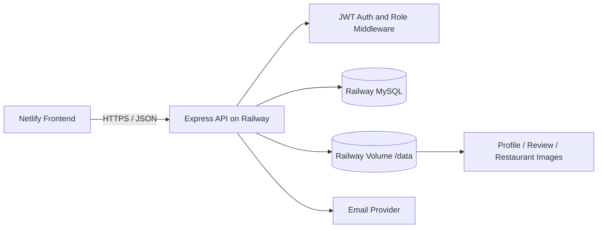
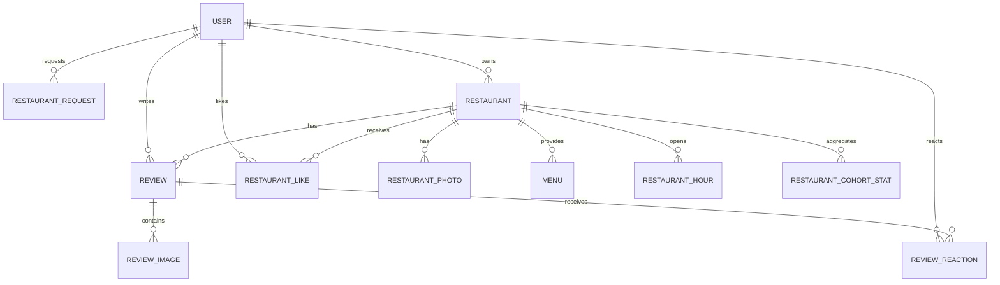
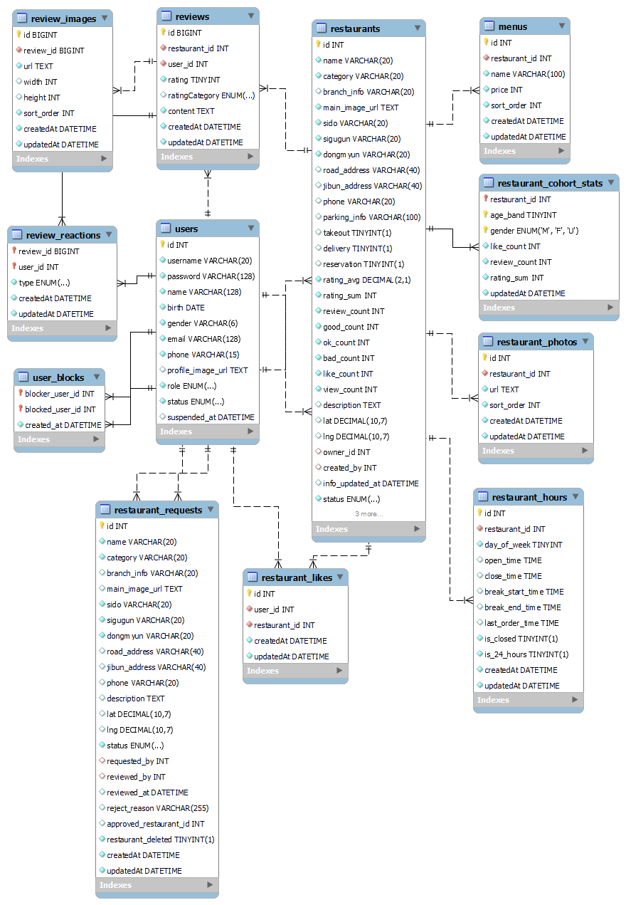

# BGS Backend

사용자의 위치와 취향 맥락을 반영해 식당을 탐색하고 추천하는 **BGS(배고파)** 서비스의 REST API 서버입니다.

단순 평점순의 한계를 줄이기 위해 전체 리뷰·조회·찜 지표에 연령대와 성별 코호트 통계를 결합했으며, 사용자·점주·관리자의 권한을 분리해 식당 등록 요청부터 승인, 운영, 폐점, 관리까지 이어지는 흐름을 구현했습니다.

## Links

- [Live Demo](https://baegopa-eats.netlify.app)
- Frontend Repository: [BGS-client](https://github.com/JJeSeok/BGS-client)
- Backend Repository: [BGS-server](https://github.com/JJeSeok/BGS-server)
- [Backend API](https://bgs.up.railway.app/restaurants)

> **Demo account**
>
> - ID: **demouser**
> - Password: **a1234567!**
>
> 관리자 계정 정보는 README에 공개하지 않습니다.

## Table of Contents

- [Project Overview](#project-overview)
- [Backend Highlights](#backend-highlights)
- [Architecture](#architecture)
- [Data Model](#data-model)
- [Tech Stack](#tech-stack)
- [API Overview](#api-overview)
- [Directory Structure](#directory-structure)
- [Local Setup](#local-setup)
- [Seed Data](#seed-data)
- [Deployment](#deployment)
- [Performance](#performance)
- [Troubleshooting](#troubleshooting)
- [Security Notes](#security-notes)
- [Remaining Work](#remaining-work)

## Project Overview

BGS는 식당 검색과 리뷰 기능에 개인화 추천 맥락을 더한 서비스입니다.

| Item               | Description                                                                       |
| ------------------ | --------------------------------------------------------------------------------- |
| Development Period | 2025.07 ~ 2026.06 (핵심 기능 2026.03 완료, 2026.05~06 안정화 및 배포)             |
| Team               | 개인 프로젝트 (1명)                                                               |
| Role               | 서비스 기획, 데이터베이스 설계, REST API 및 프론트엔드 구현, Railway·Netlify 배포 |

- 식당 검색, 지역 필터, 거리순 및 추천순 정렬
- 지도 반경 내 식당 조회
- 리뷰 작성·수정·삭제와 이미지 첨부
- 식당 찜과 리뷰 좋아요·싫어요
- 사용자 차단 및 마이페이지 활동 조회
- 사용자 식당 등록 요청과 관리자 승인·반려
- 점주의 식당 정보 수정 및 영업 종료 처리
- 관리자의 사용자·리뷰·식당·등록 요청 관리

## Backend Highlights

### 1. Cohort-aware Recommendation

리뷰가 적은 식당이 소수의 높은 평점만으로 상위에 노출되는 문제를 완화하기 위해 Bayesian average를 사용합니다. 여기에 조회수와 찜 수를 로그 스케일로 반영하고, 로그인 사용자의 연령대·성별 코호트 반응을 보너스로 결합합니다.

```text
globalBayes =
  (reviewCount / (reviewCount + M_GLOBAL)) * ratingAverage
  + (M_GLOBAL / (reviewCount + M_GLOBAL)) * globalAverage

basePopularity =
  (log(1 + viewCount) + 2 * log(1 + likeCount)) * W_POP

recommendationScore =
  globalBayes + basePopularity + cohortRatingBonus + cohortLikeBonus
```

- 비로그인 사용자: 전체 평점과 인기도 기반 추천
- 로그인 사용자: 사용자의 연령대와 성별에 해당하는 코호트 반응 추가
- 코호트 데이터가 부족한 경우: 전체 평균으로 수축해 과적합 완화
- 리뷰 및 찜 생성·수정·삭제 시 코호트 통계를 트랜잭션 안에서 함께 갱신

현재 가중치는 [`data/restaurant.js`](./data/restaurant.js)에서 관리합니다.

### 2. Query and Pagination Strategy

- 목록 조회에 offset 대신 **keyset cursor pagination**을 적용해 뒤 페이지에서도 일정한 조회 비용 유지
- 거리 계산 전에 위도·경도 bounding box로 후보를 제한한 뒤 Haversine 공식을 적용
- 평점 합계, 리뷰 수, 평가 구간별 개수, 찜 수를 식당 테이블에 집계해 목록 조회 시 반복 집계 제거
- 추천순, 평점순, 조회순, 찜순, 리뷰순, 거리순에 안정적인 보조 정렬 키 적용
- 검색어를 최대 5개 토큰으로 제한하고 이름·분류·주소 영역을 통합 검색

### 3. Transactional Consistency

다음 작업은 Sequelize transaction으로 원본 데이터와 파생 통계를 함께 변경합니다.

- 리뷰 생성·수정·삭제와 식당 평점 통계 갱신
- 찜 추가·해제와 식당 및 코호트 찜 수 갱신
- 식당 등록 요청 승인과 식당 생성
- 관리자 식당 삭제와 관련 데이터 정리

식당을 하드 삭제할 때 DB의 연관 데이터는 cascade로 정리하고, 트랜잭션 성공 후 식당·리뷰 이미지 파일도 삭제합니다. 등록 요청 이력에는 `restaurant_deleted` 상태를 남겨 삭제된 식당으로 이동하지 않도록 했습니다.

### 4. Authentication and Authorization

- JWT Bearer 인증
- bcrypt 비밀번호 해싱
- `user` / `admin` 역할 기반 관리자 API 보호
- 점주 또는 관리자만 식당 정보와 영업 상태를 변경할 수 있도록 소유권 검증
- 탈퇴 사용자는 개인정보를 익명화하고 계정 상태를 `deleted`로 변경
- 이메일 인증번호는 원문 대신 salt를 사용한 HMAC-SHA256 결과로 저장
- 비밀번호 복구 요청에 rate limit 적용

### 5. Image Upload and Persistent Storage

- Multer 기반 이미지 업로드
- MIME type 및 파일 크기 검증
- 리뷰 이미지는 요청당 최대 10개, 파일당 최대 5MB로 제한
- 유효성 검사나 DB 처리 실패 시 먼저 저장된 파일을 정리
- Railway Volume을 `/data`에 마운트하고 `UPLOAD_DIR=/data/uploads`로 영구 저장
- 정적 이미지에 7일 브라우저 캐시 적용
- 포트폴리오 시드 이미지를 WebP로 변환해 약 **57MB에서 3.15MB로 축소**

## Architecture



## Data Model



### Detailed ERD



## Tech Stack

| Category              | Technology                                          |
| --------------------- | --------------------------------------------------- |
| Runtime               | Node.js 20                                          |
| Framework             | Express 4                                           |
| Database              | MySQL 8, Sequelize 6, mysql2                        |
| Authentication        | JWT, bcrypt                                         |
| Validation / Security | express-validator, Helmet, CORS, express-rate-limit |
| File Upload           | Multer, Railway Volume                              |
| Email                 | Nodemailer                                          |
| Deployment            | Railway, Netlify                                    |
| Load Test             | Autocannon                                          |

## API Overview

| Domain     | Method           | Endpoint                        | Description                           |
| ---------- | ---------------- | ------------------------------- | ------------------------------------- |
| Restaurant | GET              | `/restaurants`                  | 검색·필터·정렬·커서 페이지네이션 목록 |
| Restaurant | GET              | `/restaurants/map`              | 지도 반경 내 식당 조회                |
| Restaurant | GET              | `/restaurants/:id`              | 식당 상세 조회 및 조회수 증가         |
| Restaurant | POST/DELETE      | `/restaurants/:id/likes`        | 식당 찜 추가·해제                     |
| Owner      | GET              | `/restaurants/owner/:id/edit`   | 점주용 식당 수정 데이터 조회          |
| Owner      | PATCH            | `/restaurants/owner/:id`        | 점주 식당 정보 수정                   |
| Owner      | PATCH            | `/restaurants/owner/:id/status` | 식당 영업 종료 처리                   |
| Review     | GET/POST         | `/reviews`                      | 리뷰 목록·작성                        |
| Review     | PUT/DELETE       | `/reviews/:id`                  | 리뷰 수정·삭제                        |
| Review     | POST             | `/reviews/:id/reactions`        | 리뷰 좋아요·싫어요 토글               |
| User       | POST             | `/users/signup`, `/users/login` | 회원가입·로그인                       |
| User       | GET/PATCH/DELETE | `/users/me`                     | 내 정보 조회·수정·탈퇴                |
| User       | GET              | `/users/me/meta`                | 마이페이지 활동 통계                  |
| Request    | POST             | `/restaurant-requests`          | 식당 등록 요청                        |
| Request    | GET              | `/restaurant-requests/me`       | 내 등록 요청 이력                     |
| Admin      | GET/PATCH/DELETE | `/admin/restaurants/*`          | 식당 상태 및 데이터 관리              |
| Admin      | GET/PATCH        | `/admin/users/*`                | 사용자 상태 관리                      |
| Admin      | GET              | `/admin/reviews`                | 관리자 리뷰 목록 조회                 |
| Admin      | DELETE           | `/reviews/:id`                  | 관리자 또는 작성자의 리뷰 삭제        |
| Admin      | GET/POST         | `/admin/restaurant-requests/*`  | 등록 요청 승인·반려                   |

## Directory Structure

```text
server/
├── controller/    # HTTP 요청 검증과 응답 조립
├── data/          # Sequelize 모델, 연관관계, SQL 및 데이터 접근
├── middleware/    # 인증·인가·검증·업로드 처리
├── router/        # 도메인별 REST 라우트
├── jobs/          # 만료 데이터 정리 스케줄러
├── scripts/       # 시드 스크립트와 데이터
├── utils/         # 파일·메일·OTP·코호트 유틸리티
├── db/            # Sequelize 연결 설정
├── app.js         # Express 애플리케이션 진입점
└── config.js      # 환경변수 구성
```

## Local Setup

### Requirements

- Node.js 20.x
- MySQL 8.x
- npm

### Installation

```bash
git clone https://github.com/JJeSeok/BGS-server.git
cd BGS-server
npm install
```

프로젝트 루트에 `.env`를 작성합니다. 실제 비밀값은 Git에 커밋하지 않습니다.

```env
JWT_SECRET=replace-with-a-long-random-secret
JWT_EXPIRES_SEC=86400
BCRYPT_SALT_ROUNDS=12

DB_HOST=localhost
DB_USER=your_mysql_user
DB_DATABASE=your_database
DB_PASSWORD=your_mysql_password

PORT=8080
CORS_ALLOW_ORIGIN=http://localhost:5500
UPLOAD_DIR=uploads

MAIL_USER=your_email@example.com
MAIL_APP_PASSWORD=your_mail_app_password
APP_NAME=BGS

SEED_ADMIN_PASSWORD=replace-with-seed-admin-password
SEED_DEMO_PASSWORD=replace-with-seed-demo-password
```

개발 서버를 실행합니다.

```bash
npm run dev
```

운영 방식으로 실행할 때는 다음 명령을 사용합니다.

```bash
npm start
```

### Generated Rating Column

`reviews.ratingCategory`는 평점을 기준으로 계산되는 MySQL generated column입니다. 최초 테이블 생성 후 다음 SQL을 적용합니다.

```sql
ALTER TABLE reviews
MODIFY COLUMN ratingCategory ENUM('good', 'ok', 'bad')
GENERATED ALWAYS AS (
  CASE
    WHEN rating >= 7 THEN 'good'
    WHEN rating >= 3 THEN 'ok'
    ELSE 'bad'
  END
) STORED;
```

서버는 평점을 `0~10` 정수로 저장하며, 프론트에서는 이를 `0~5점`, `0.5점` 단위로 표시합니다.

## Seed Data

시드는 사용자 → 식당 → 활동 → 등록 요청 순서로 실행합니다.

```bash
npm run seed:users
npm run seed:restaurants
npm run seed:engagement
npm run seed:requests
```

- `seed:users`: 관리자·데모·코호트 사용자 생성
- `seed:restaurants`: 식당 18개, 메뉴, 영업시간, WebP 이미지 등록
- `seed:engagement`: 리뷰·찜과 식당/코호트 집계 재생성
- `seed:requests`: 승인 대기·승인·반려·삭제 이력 생성

시드 스크립트는 여러 번 실행해도 시드 대상 데이터를 기준으로 갱신하도록 작성했습니다. 운영 DB에서 실행하기 전 대상 환경을 반드시 확인해야 합니다.

## Deployment

```text
Frontend  : Netlify
Backend   : Railway
Database  : Railway MySQL
File Store: Railway Volume mounted at /data
```

업로드 파일은 `UPLOAD_DIR=/data/uploads` 아래에 저장해 재배포 후에도 유지합니다.
배포된 Netlify Origin만 CORS에서 허용합니다.

## Performance

적용한 최적화:

- 집계 컬럼으로 목록 조회 시 `COUNT`, `SUM`, `AVG` 반복 계산 제거
- offset 대신 keyset cursor pagination 적용
- bounding box로 거리 계산 대상 축소
- 다중 컬럼 인덱스와 정렬 보조 키 구성
- WebP 변환으로 시드 이미지 전체 용량 약 94% 절감
- 서버와 MySQL을 동일한 Singapore 리전에 배치

### Restaurant List API Benchmark

기존에는 식당 목록을 조회할 때 리뷰와 좋아요 테이블을 매번 집계해 데이터 증가에 따라 응답 시간이 크게 늘어났습니다. 식당 테이블에 평점 합계·평균, 리뷰 수, 평가 구간별 개수와 좋아요 수를 집계 컬럼으로 관리하고, 리뷰와 좋아요가 변경될 때 트랜잭션 안에서 함께 갱신하도록 개선했습니다.

| Metric        | Before |  After | Reduction |
| ------------- | -----: | -----: | --------: |
| Latency Avg   | 2.353s | 0.009s |     99.6% |
| Latency p97.5 | 2.821s | 0.015s |     99.5% |

- Endpoint: `GET /restaurants`
- Dataset: 식당 20,000개, 리뷰 약 300,000개, 좋아요 약 300,000개
- Concurrent connections: 10
- Duration: 45 seconds
- Environment: Local, Node.js 20, MySQL 8
- Measurement: Autocannon으로 3회 측정한 결과의 중앙값

```bash
npx autocannon -c 10 -d 45 http://localhost:8080/restaurants
```

## Troubleshooting

### 1. Helmet의 CORP 정책으로 인한 이미지 차단

- **문제:** 프론트엔드에서 서버의 이미지를 요청할 때 `NotSameOrigin` 오류가 발생했습니다.
- **원인:** Helmet의 `Cross-Origin-Resource-Policy` 기본 정책이 다른 Origin의 이미지 로드를 차단하고 있었습니다.
- **해결:** 전체 보안 정책을 완화하지 않고, 정적 이미지를 제공하는 `/uploads` 경로에만 `cross-origin` 정책을 적용했습니다. API 접근 Origin은 CORS 설정으로 별도 제한했습니다.
- **결과:** API 보안 정책을 유지하면서 프론트엔드에서 이미지를 정상적으로 표시할 수 있게 됐습니다.

### 2. Sequelize 모델의 순환 참조

- **문제:** 모델 파일에서 서로의 연관관계를 직접 정의하면서 `Cannot access 'Restaurant' before initialization` 오류가 발생했습니다.
- **원인:** ES Module의 순환 import 과정에서 모델 변수가 초기화되기 전에 다른 모듈이 해당 변수를 참조했습니다.
- **해결:** 모델 파일에서는 모델 정의만 담당하고, 모든 연관관계를 `data/association.js`로 분리했습니다. 애플리케이션 시작 시 `app.js`에서 이 파일을 한 번 import해 관계를 등록했습니다.
- **결과:** 모델 간 순환 의존성을 제거하고 연관관계 설정을 한 곳에서 관리할 수 있게 됐습니다.

### 3. 리뷰가 없는 상태를 오류로 처리한 API 계약

- **문제:** 리뷰가 없는 식당이나 사용자의 리뷰 목록을 `404 Not Found`로 반환해 프론트엔드가 빈 상태와 실제 오류를 구분하지 못했습니다.
- **원인:** 조회 결과가 0건인 정상적인 컬렉션 상태를 리소스가 존재하지 않는 상태와 동일하게 처리했습니다.
- **해결:** 목록 조회는 `200 OK`와 빈 배열, 종료된 페이지 정보를 반환하도록 변경했습니다. 리뷰 통계도 데이터가 없을 때 각 개수를 0으로 반환하도록 응답 계약을 통일했습니다.
- **결과:** 프론트엔드가 별도 예외 처리 없이 빈 리뷰 화면과 통계를 안정적으로 표시할 수 있게 됐습니다.

### 4. DB cascade 이후 남는 이미지 파일

- **문제:** 리뷰나 식당을 삭제하면 연관된 이미지 레코드는 cascade로 제거되지만 실제 이미지 파일은 서버 저장소에 남았습니다.
- **원인:** DB의 referential action은 파일시스템까지 관리하지 않기 때문에 삭제 후 사용되지 않는 파일이 계속 쌓였습니다.
- **해결:** 삭제 트랜잭션 안에서 관련 이미지 URL을 먼저 조회한 뒤 DB 데이터를 삭제하고, 트랜잭션이 성공하면 해당 URL을 실제 경로로 변환해 파일을 정리했습니다. 식당 삭제 시에는 대표·서브·리뷰 이미지를 모두 대상으로 처리했습니다.
- **결과:** DB 상태와 파일 저장소의 수명주기를 함께 관리해 불필요한 파일 누적을 방지했습니다.

### 5. Railway 재배포 후 업로드 파일 유실

- **문제:** 배포 컨테이너의 임시 파일시스템에 저장한 이미지가 재배포 후 사라질 수 있었습니다.
- **해결:** Railway Volume을 `/data`에 마운트하고 `UPLOAD_DIR=/data/uploads`를 기준으로 모든 업로드·정적 파일·삭제 경로를 통일했습니다.
- **결과:** 애플리케이션 재배포와 무관하게 사용자 업로드 파일이 유지되도록 구성했습니다.

### 6. 대용량 시드 이미지로 인한 초기 로딩 지연

- **문제:** 1448×1086 PNG 시드 이미지 26개의 전체 용량이 약 57MB여서 첫 화면 이미지 표시가 느렸습니다.
- **해결:** 이미지를 최대 1200×900, 품질 82의 WebP로 변환했습니다.
- **결과:** 전체 용량을 약 3.15MB로 줄여 약 94%를 절감하고 초기 이미지 로딩 속도를 개선했습니다.

### 7. 배포 리전으로 인한 네트워크 지연

- **문제:** 미국 리전 배포와 일시적인 인프라 이상이 겹치면서 한국 사용자 기준 응답 지연이 발생했습니다.
- **해결:** 서버·MySQL·볼륨을 모두 Singapore 리전으로 통일하고 재배포했습니다.
- **결과:** 배포 환경에서 메인 페이지 약 0.5초, 식당 상세 약 0.8초, 마이페이지 약 1.6초 수준으로 표시 시간을 개선했습니다.

## Security Notes

- `.env`, 운영 DB 인증정보, JWT secret, 메일 앱 비밀번호는 저장소에 포함하지 않습니다.
- 관리자 계정은 공개 데모 계정과 분리합니다.
- CORS는 실제 프론트엔드 Origin 하나만 허용합니다.
- 업로드 파일은 형식·크기·개수를 서버에서 다시 검증합니다.
- 비밀번호와 이메일 인증번호 원문을 DB에 저장하지 않습니다.

## Remaining Work

- Sequelize migration 도입 및 운영 환경의 `sequelize.sync()` 제거
- 자동화 테스트와 CI 파이프라인 구축
- 사용자 업로드 이미지의 WebP 자동 변환 및 썸네일 생성
- Object Storage와 CDN을 통한 이미지 전달 구조 확장
- API 명세 자동화(OpenAPI/Swagger)
